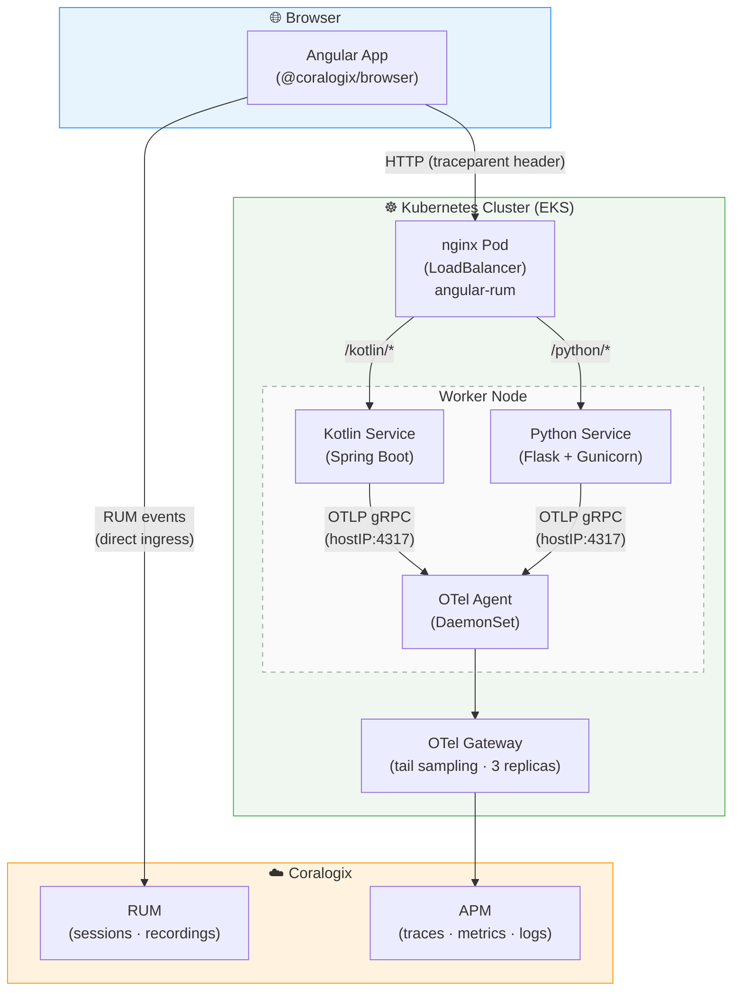

# Insurance Direct — OpenTelemetry POC

This repo contains reference instrumentation examples for Kotlin and Python services running on Kubernetes. Before the integration call, instrument your services using the steps below. During the call we will connect your cluster to the Coralogix backend and provision the collector and agents.

---

## Architecture



The OTel agent runs as a DaemonSet — one pod per node. Each service sends telemetry to the agent on the same node via the node's host IP, the agent forwards to the gateway for tail sampling, and the gateway ships to Coralogix.

Browser RUM data bypasses the agent entirely — the `@coralogix/browser` SDK sends directly to Coralogix ingress. The `traceparent` header injected into API calls links browser spans to backend OTel spans for end-to-end traces.

---

## Kotlin / Java (JVM)

Instrumentation is done via the [OpenTelemetry Java agent](https://github.com/open-telemetry/opentelemetry-java-instrumentation/releases/latest) — no code changes required.

### 1. Add the agent to your Docker image

```dockerfile
ADD https://github.com/open-telemetry/opentelemetry-java-instrumentation/releases/latest/download/opentelemetry-javaagent.jar /app/opentelemetry-javaagent.jar
ENV JAVA_TOOL_OPTIONS="-javaagent:/app/opentelemetry-javaagent.jar"
```

### 2. Add env vars to your K8s deployment

```yaml
env:
  - name: OTEL_IP
    valueFrom:
      fieldRef:
        fieldPath: status.hostIP
  - name: OTEL_EXPORTER_OTLP_ENDPOINT
    value: http://$(OTEL_IP):4317
  - name: OTEL_SERVICE_NAME
    value: your-service-name
  - name: OTEL_SERVICE_VERSION
    value: "1.0.0"
  - name: OTEL_RESOURCE_ATTRIBUTES
    value: cx.application.name=insurance-direct,cx.subsystem.name=your-service-name
  - name: OTEL_EXPORTER_OTLP_PROTOCOL
    value: grpc
```

> `cx.application.name` and `cx.subsystem.name` are how your service appears in Coralogix. Set them to something meaningful.

See the full example in [`kotlin-service/k8s/deployment.yaml`](./kotlin-service/k8s/deployment.yaml).

---

## Python

Python uses the `opentelemetry-distro` package for zero-code auto-instrumentation.

### 1. Add dependencies to your image

```dockerfile
RUN pip install opentelemetry-distro opentelemetry-exporter-otlp
RUN opentelemetry-bootstrap -a install
```

### 2. Run your app via `opentelemetry-instrument`

```dockerfile
CMD ["opentelemetry-instrument", "gunicorn", "app:app", "--bind", "0.0.0.0:8000", "--preload"]
```

### 3. Add env vars to your K8s deployment

```yaml
env:
  - name: OTEL_IP
    valueFrom:
      fieldRef:
        fieldPath: status.hostIP
  - name: OTEL_EXPORTER_OTLP_ENDPOINT
    value: http://$(OTEL_IP):4317
  - name: OTEL_SERVICE_NAME
    value: your-service-name
  - name: OTEL_SERVICE_VERSION
    value: "1.0.0"
  - name: OTEL_RESOURCE_ATTRIBUTES
    value: cx.application.name=insurance-direct,cx.subsystem.name=your-service-name
  - name: OTEL_EXPORTER_OTLP_PROTOCOL
    value: grpc
```

See the full example in [`python-service/k8s/deployment.yaml`](./python-service/k8s/deployment.yaml).

---

## Angular (RUM)

> **Official SDK docs:** [npmjs.com/package/@coralogix/browser](https://www.npmjs.com/package/@coralogix/browser?activeTab=readme) — the example below is a sample showing how it can be done, not a substitute for the full guide.

Real User Monitoring runs entirely in the browser — no OTel agent involved. RUM data is sent directly from the user's browser to Coralogix.

### 1. Install the SDK

```bash
npm install @coralogix/browser
```

### 2. Initialise before bootstrapping your app

In `main.ts`, call `CoralogixRum.init()` before `bootstrapApplication()`:

```ts
import { CoralogixRum } from '@coralogix/browser';

CoralogixRum.init({
  application: 'your-app-name',
  environment: 'production',
  public_key: '<your-rum-public-key>',
  coralogixDomain: 'EU2',
  version: '1.0.0',
  runOutsideAngularZone: true,
  sessionRecordingConfig: {
    enable: true,
    autoStartSessionRecording: true,
    recordConsoleEvents: true,
    sessionRecordingSampleRate: 100,
  },
  traceParentInHeader: {
    enabled: true,
  },
});
```

> **RUM public key** is different from the Send-Your-Data API key used for the collector. Find it in Coralogix under *Data Flow → API Keys → RUM*.
>
> **`traceParentInHeader`** injects a `traceparent` header into HTTP requests your app makes to backend services. This links browser spans to backend OTel spans, giving you a full end-to-end trace in one view — no backend changes required.

See the full example in [`angular-rum/src/main.ts`](./angular-rum/src/main.ts).

---

## Reference services

| Directory | Language / Type | Framework | Endpoints |
|---|---|---|---|
| [`kotlin-service/`](./kotlin-service/) | Kotlin (JVM) | Spring Boot | `GET /policies`, `POST /claims` |
| [`python-service/`](./python-service/) | Python | Flask + Gunicorn | `GET /policies`, `GET /policies/{id}`, `POST /claims` |
| [`angular-rum/`](./angular-rum/) | TypeScript (Browser) | Angular 17 | RUM demo UI |

